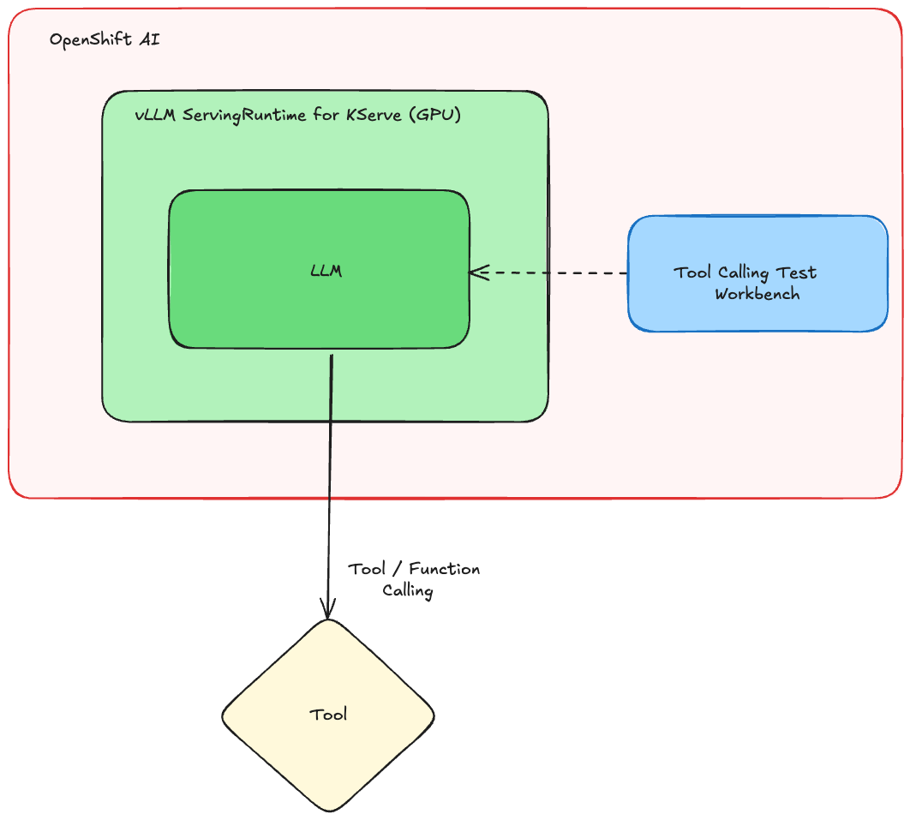
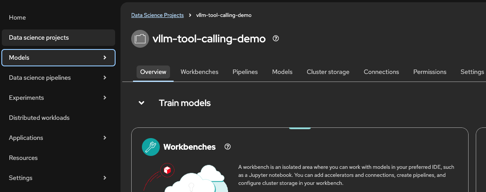
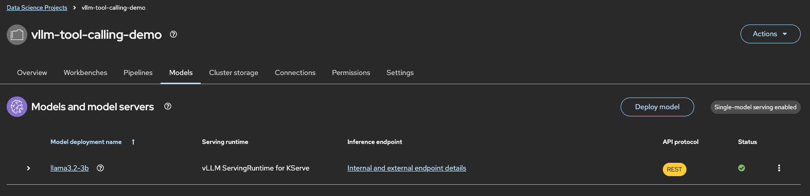
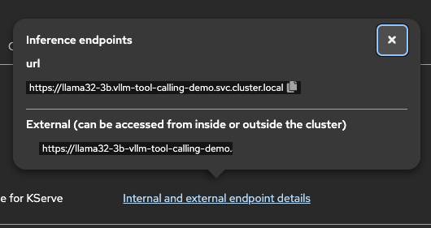
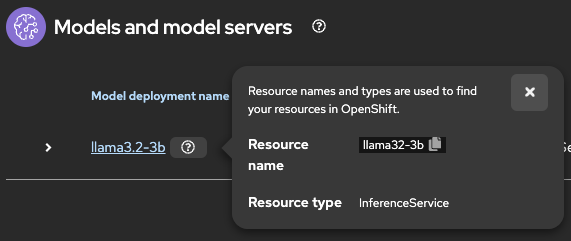
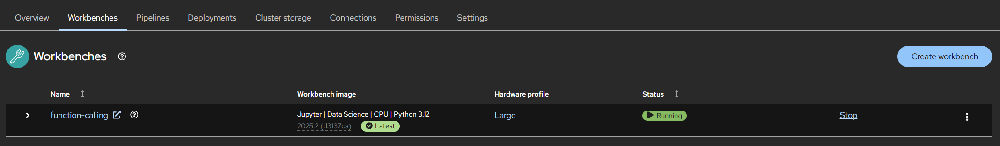
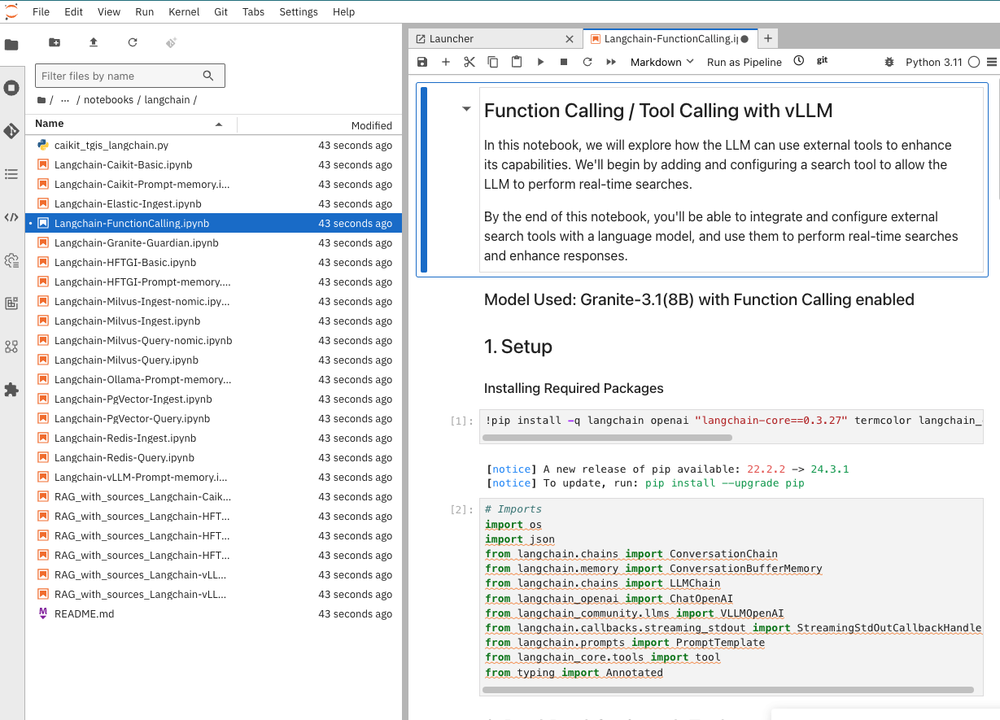

# vLLM Tool Calling 


Welcome to the vLLM [Function Calling](https://ai-on-openshift.io/odh-rhoai/enable-function-calling/) Quickstart!  

Use this to quickly get a vLLM runtime with Function Calling enabled in your OpenShift AI environment, loading models directly from ModelCar containers.  

To see how it's done, jump straight to [installation](#install).

## Table of Contents

- [vLLM Tool Calling](#vllm-tool-calling)
- [Detailed description](#detailed-description)
    - [See it in action](#see-it-in-action)
    - [Architecture diagrams](#architecture-diagrams)
    - [References](#references)
- [Requirements](#requirements)
    - [Minimum hardware requirements](#minimum-hardware-requirements)
    - [Required software](#required-software)
    - [Required permissions](#required-permissions)
- [Install](#install)
    - [Clone the repository](#clone-the-repository)
    - [Create the project](#create-the-project)
    - [Choose your LLM to be deployed](#choose-your-llm-to-be-deployed)
    - [Check the deployment](#check-the-deployment)

## Detailed description

The vLLM Function Calling Quickstart is a template for deploying vLLM with Function Calling enabled, integrated with ModelCar containerized models, within Red Hat OpenShift AI.

It’s designed for environments where you want to:

- Enable LLMs to call external tools (Tool/Function Calling).
- Serve LLMs (like Granite3, Llama3) directly from a container.
- Easily customize your model deployments without needing cluster admin privileges.

Use this project to quickly spin up a powerful vLLM instance ready for function-enabled Agents or AI applications.

### Architecture diagrams



### References 

- The runtime is out of the box in RHOAI called [vLLM ServingRuntime for KServe](https://docs.redhat.com/en/documentation/red_hat_openshift_ai_self-managed/2.19/html/serving_models/serving-large-models_serving-large-models#supported-model-serving-runtimes_serving-large-models)
- Detailed guide and documentations is available in [this article.](https://ai-on-openshift.io/odh-rhoai/enable-function-calling/)
- Code for testing the Function Calling in OpenShift AI is in [github.com/rh-aiservices-bu/llm-on-openshift](https://github.com/rh-aiservices-bu/llm-on-openshift/blob/main/examples/notebooks/langchain/Langchain-FunctionCalling.ipynb)

NOTE: To find more patterns and pre-built ModelCar images, take a look at the [Red Hat AI Services ModelCar Catalog repo](https://github.com/redhat-ai-services/modelcar-catalog) on GitHub and the [ModelCar Catalog registry](https://quay.io/repository/redhat-ai-services/modelcar-catalog) on Quay. 

## Requirements

### Minimum hardware requirements

- 8+ vCPUs with 4th Gen Intel® Xeon® Scalable processors or newer
- 24+ GiB RAM
- Storage: 30Gi minimum in PVC (larger models may require more)

#### Optional, depending on selected hardware platform
- 1 GPU (NVIDIA L40, A10, or similar)
- 1 Intel® Gaudi® AI Accelerator

### Required software  
- Red Hat OpenShift 
- Red Hat OpenShift AI 2.16+
- Dependencies for [Single-model server](https://docs.redhat.com/en/documentation/red_hat_openshift_ai_self-managed/2.16/html/installing_and_uninstalling_openshift_ai_self-managed/installing-the-single-model-serving-platform_component-install#configuring-automated-installation-of-kserve_component-install):
    - Red Hat OpenShift Service Mesh
    - Red Hat OpenShift Serverless

### Required permissions

- Standard user. No elevated cluster permissions required 

## Install

**Please note before you start**

This example was tested on Red Hat OpenShift 4.16.24 & Red Hat OpenShift AI v2.16.2.  

### Clone the repository

```
git clone https://github.com/rh-ai-quickstart/vllm-tool-calling.git && \
    cd vllm-tool-calling/  
```

### Create the project

`PROJECT` can be set to any value. This will also be used as the namespace.

```bash
export PROJECT="vllm-tool-calling-demo"

oc new-project $PROJECT
```

Specify your LLM and device:
- MODEL: select from [[granite3.2-8b](https://huggingface.co/ibm-granite/granite-3.2-8b-instruct), [llama3.2-1b](https://huggingface.co/meta-llama/Llama-3.2-1B), [llama3.2-3b](https://huggingface.co/meta-llama/Llama-3.2-3B)]
- DEVICE: select from [cpu, gpu, hpu]

Set variables to the selected options. Example is shown below.
```bash
export MODEL="granite3.2-8b"
export DEVICE="gpu"
```

Deploy the LLM on the target hardware:
```bash
oc apply -n $PROJECT -k vllm-tool-calling/$MODEL/$DEVICE
```

### Check the deployment

* From the OpenShift Console, go to the App Switcher / Waffle in the upper right and go to the Red Hat OpenShift AI Dashboard.

* Once inside the dashboard, navigate to Data Science Projects or Projects -> vllm-tool-calling-demo (or the values of ${PROJECT} if changed from the default):



* Check the models deployed, and wait for the green tick in the Status, meaning that the model is deployed successfully:



> **Important:** Note down the **URL of the inference endpoint** and **resource name of the model deployment**. They will be used in the function calling section.






Alternatively, the model status can be checked using OC client:
```bash
oc get pods
oc logs -f <model-name-device-predictor-pod>
```
Look for `Application startup complete.`

### Function Calling in OpenShift AI
Now that the model is deployed, it can be used with function calling. The notebook from [github.com/rh-aiservices-bu/llm-on-openshift](https://github.com/rh-aiservices-bu/llm-on-openshift/blob/main/examples/notebooks/langchain/Langchain-FunctionCalling.ipynb) is used for this example.

Inside the OpenShift AI Dashboard, go to Data Science Projects or Projects -> vllm-tool-calling-demo (or the values of ${PROJECT} if changed from the default) -> Workbenches. Create a workbench based on the hardware platform used. When it is in the `Running` state, click on the name of the workbench to open the Jupyter environment.



In the Launcher, open a Terminal. Clone the rh-aiservices-bu repo:
```bash
git clone https://github.com/rh-aiservices-bu/llm-on-openshift.git
```

On the left-hand side, navigate to rh-aiservices-bu/llm-on-openshift/examples/notebooks/langchain. Open the Langchain-FunctionCalling.ipynb notebook.



Execute the first few cells. In section 3 Model Configuration, set the following variables depending on the model deployed:
- **INFERENCE_SERVER_URL**: the inference endpoint noted down AND append `:8080` since that is the default port for vLLM
- **MODEL_NAME**: the model deployment name noted down
- **API_KEY**: set to `"EMPTY"`

Continue running the rest of the notebook to invoke tools. The `query` can also be customized.

### Cleanup

To remove all deployed components:
```bash
oc delete -n $PROJECT -f vllm-tool-calling/$MODEL/$DEVICE
```

Delete the project:
```bash
oc delete project $PROJECT
```
