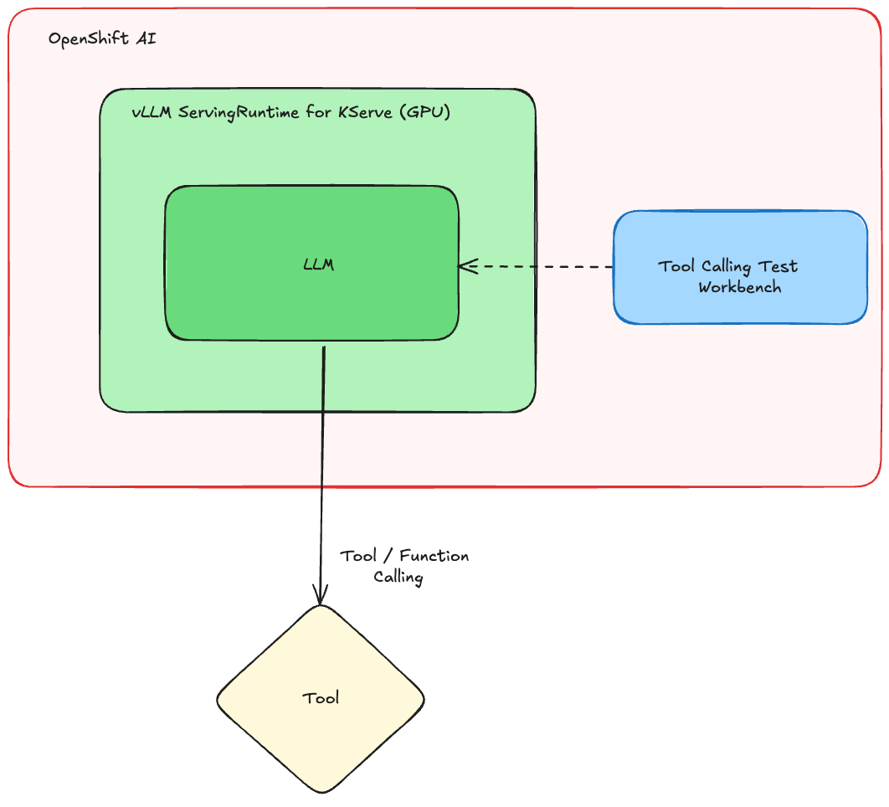
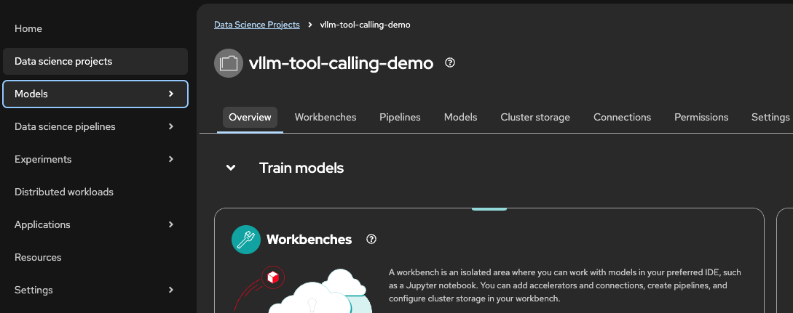

# vLLM Tool Calling 


Welcome to the vLLM [Function Calling](https://ai-on-openshift.io/odh-rhoai/enable-function-calling/) Kickstart!  

Use this to quickly get a vLLM runtime with Function Calling enabled in your OpenShift AI environment, loading models directly from ModelCar containers.  

To see how it's done, jump straight to [installation](#install).

## Table of Contents

- [vLLM Tool Calling](#vllm-tool-calling)
- [1. Description](#1-description)
- [2. See it in action](#2-see-it-in-action)
- [3. Architecture diagrams](#3-architecture-diagrams)
- [4. References](#4-references)
- [5. Prerequirements](#5-prerequirements)
    - [5.1 Minimum hardware requirements](#51-minimum-hardware-requirements)
    - [5.2 Required software](#52-required-software)
    - [5.3 Required permissions](#53-required-permissions)
- [6. Install](#6-install)
    - [6.1 Clone the repository](#61-clone-the-repository)
    - [6.2 Create the project](#62-create-the-project)
    - [6.3 Choose your LLM to be deployed](#63-choose-your-llm-to-be-deployed)
    - [6.4 Wait for pods](#64-wait-for-pods)
- [7. Test](#7-test)

## 1. Description

The vLLM Function Calling Kickstart is a template for deploying vLLM with Function Calling enabled, integrated with ModelCar containerized models, within Red Hat OpenShift AI.

It’s designed for environments where you want to:

- Enable LLMs to call external tools (Tool/Function Calling).
- Serve LLMs (like Granite3, Llama3) directly from a container.
- Easily customize your model deployments without needing cluster admin privileges.

Use this project to quickly spin up a powerful vLLM instance ready for function-enabled Agents or AI applications.

## 2. See it in action

Red Hat uses Arcade software to create interactive demos. Check out [Function Calling Kickstart Example](TBD) to see it live.

## 3. Architecture diagrams



## 4. References 

- The runtime is out of the box in RHOAI called [vLLM ServingRuntime for KServe](https://docs.redhat.com/en/documentation/red_hat_openshift_ai_self-managed/2.19/html/serving_models/serving-large-models_serving-large-models#supported-model-serving-runtimes_serving-large-models)
- Detailed guide and documentations is available in [this article.](https://ai-on-openshift.io/odh-rhoai/enable-function-calling/)
- Code for testing the Function Calling in OpenShift AI is in [github.com/rh-aiservices-bu/llm-on-openshift](https://github.com/rh-aiservices-bu/llm-on-openshift/blob/main/examples/notebooks/langchain/Langchain-FunctionCalling.ipynb)

NOTE: To find more patterns and pre-built ModelCar images, take a look at the [Red Hat AI Services ModelCar Catalog repo](https://github.com/redhat-ai-services/modelcar-catalog) on GitHub and the [ModelCar Catalog registry](https://quay.io/repository/redhat-ai-services/modelcar-catalog) on Quay. 

## 5. Prerequirements

### 5.1 Minimum hardware requirements

- 8+ vCPUs
- 24+ GiB RAM
- Storage: 30Gi minimum in PVC (larger models may require more)

#### Optional, depending on selected hardware platform
- 1 GPU (NVIDIA L40, A10, or similar)
- 1 Intel® Gaudi® AI Accelerator

## 5.2 Required software  

- Red Hat OpenShift 
- Red Hat OpenShift AI 2.16+
- Dependencies for [Single-model server](https://docs.redhat.com/en/documentation/red_hat_openshift_ai_self-managed/2.16/html/installing_and_uninstalling_openshift_ai_self-managed/installing-the-single-model-serving-platform_component-install#configuring-automated-installation-of-kserve_component-install):
    - Red Hat OpenShift Service Mesh
    - Red Hat OpenShift Serverless

## 5.3 Required permissions

- Standard user. No elevated cluster permissions required 

## 6. Install

**Please note before you start**

This example was tested on Red Hat OpenShift 4.16.24 & Red Hat OpenShift AI v2.16.2.  

### 6.1 Clone the repository

```
git clone https://github.com/rh-ai-kickstart/vllm-tool-calling.git && \
    cd vllm-tool-calling/  
```

### 6.2 Create the project

`PROJECT` can be set to any value.

```bash
PROJECT="vllm-tool-calling-demo"

oc new-project ${PROJECT}
```

### 6.3 Choose your LLM to be deployed and the target hardware

Specify your LLM and device:
- MODEL: select from [[granite3.2-8b](https://huggingface.co/ibm-granite/granite-3.2-8b-instruct), [llama3.2-1b](https://huggingface.co/meta-llama/Llama-3.2-1B), [llama3.2-3b](https://huggingface.co/meta-llama/Llama-3.2-3B)]
- DEVICE: select from [cpu, gpu, hpu]

Set variables to the selected options. Example is shown below.
```bash
export MODEL="granite3.2-8b"
export DEVICE="gpu"
```

Update the corresponding `kustomization.yaml` file in the `vllm-tool-calling/${MODEL}/${DEVICE}` folder. `namespace` must match EXACTLY with the value of `PROJECT` set in the previous step to ensure the model is deployed in the desired project.

Deploy the LLM on the target hardware:
```bash
oc apply -k vllm-tool-calling/${MODEL}/${DEVICE}
```


### 7. Check the deployment

* From the OpenShift Console, go to the App Switcher / Waffle and go to the Red Hat OpenShift AI Console.

* Once inside the dashboard, navigate to Data Science Projects -> vllm-tool-calling-demo (or what you called your ${PROJECT} if you changed from default):



* Check the models deployed, and wait until you get the green tick in the Status, meaning that the model is deployed successfully:


